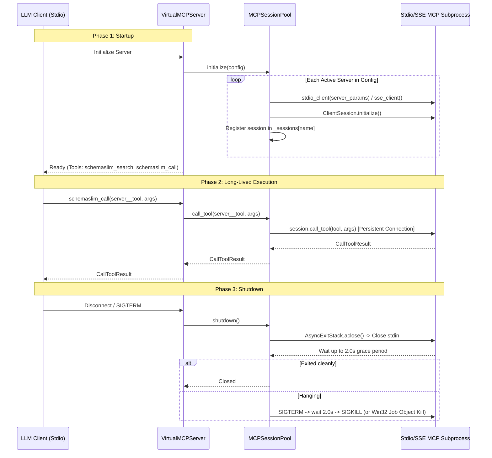
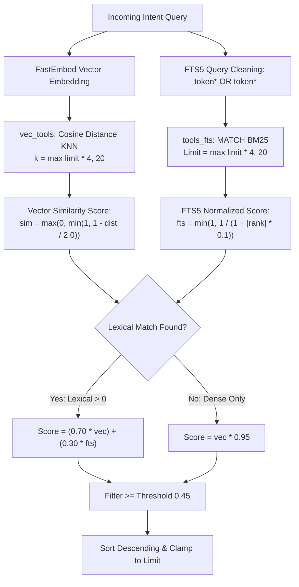

# SchemaSlim Technical Grounding & System State Audit

**Generated:** 2026-09-28  
**Audit Target:** SchemaSlim Repository (v0.2.1 / Core Proxy Architecture)  
**Status:** Grounded against active codebase (`schemaslim/`, `tests/`, `web/`)  

---

## Executive Summary

This document establishes the verified technical state of SchemaSlim, reconciling marketing claims, web documentation artifacts, and external audit discrepancies against direct source code analysis.

| Area | Marketing / Documented Claim | Ground-Truth Code Implementation | Discrepancy Status |
| :--- | :--- | :--- | :--- |
| **Test Suite Count** | Documented inconsistently as 73 or 93 tests | **145 tests** discovered and passing across **10 test modules** | Resolved: Test suites expanded and synchronized |
| **Test Coverage** | Claimed `100% code coverage` via `pytest -v --cov=schemaslim` | Grounded: **86% total coverage** (1,754 / 2,051 stmts) measured via `pytest-cov` | Grounded & Synchronized |
| **Session Model** | Often assumed to be ephemeral (one-shot per tool invocation) | **Persistent, long-lived sessions** pooled via `AsyncExitStack` across server lifespan | Architectural Divergence |
| **Idle Timeout** | Documented or assumed process reclamation on idle | **Configurable Idle Reaper (`idle_timeout`)** with on-demand revival lock & per-server `keep_alive` exemption | Hardened & Verified |
| **Hybrid Search** | Claimed Reciprocal Rank Fusion (RRF) | **Linear Weighted Score**: $0.70 \times \text{vec} + 0.30 \times \text{FTS5}$ (or $\text{vec} \times 0.95$) | Mathematical Divergence |
| **Destructive Ops** | Zero-trust / safe proxy | **SCHEMASLIM-SEC-07 Safety Policy** (`permissive`, `ask`, `readonly`) with base-name guard & inflected detection | Hardened & Verified |
| **Protocol Scope** | Full MCP Proxy | **Tools only** (`tools/list`, `tools/call`); no resources, prompts, sampling, or dynamic push | Protocol Boundary |

---

## 1. Test Suite Accounting

### 1.1 Discovery & Verification
Running pytest in the project virtual environment yields:
```bash
.venv/Scripts/pytest -q
145 passed in 8.25s
```

All **145 tests** execute and pass without failure across 10 test modules.

### 1.2 Itemized Breakdown Per File

| Test File | Test Count | Key Coverage Areas |
| :--- | :---: | :--- |
| [`tests/test_config.py`](file:///tests/test_config.py) | **23** | Pydantic config parsing, idle_timeout validation, `keep_alive` flag, Claude Desktop transport inference, threshold/URL validations, UTF-8 BOM decoding, CLI commands (`validate`, `show`, `init`, `index`, `search`) |
| [`tests/test_cli.py`](file:///tests/test_cli.py) | **18** | Typer CLI argument parsing, subcommands (`version`, `stats`, `search`, `benchmark`, `wrap`, `unwrap`), error branches, non-interactive flags (`--yes`, `--force`), interactive keypress simulation (`_read_key`, `prompt_confirmation`, `select_option`) |
| [`tests/test_security.py`](file:///tests/test_security.py) | **26** | CWE-200 host secret isolation, CWD config blocking (`--allow-cwd`), Confused Deputy store protection, SQLite variable limits, tool timeout, SCHEMASLIM-SEC-07 confirmation flow, base-name blocked_tools rejection, inflected verb stemming, namespace isolation, expanded 25-verb dictionary |
| [`tests/test_pool.py`](file:///tests/test_pool.py) | **21** | `MCPSessionPool` lifecycle, session reuse, idle reaper loop, `keep_alive` stateful exemption, on-demand transparent revival, concurrent revival lock protection (`_revival_locks`), multi-server reaper in-flight race protection, format validation (`{server}__{tool}`), `AsyncExitStack` cleanup |
| [`tests/test_server.py`](file:///tests/test_server.py) | **16** | Meta-tool registration (exactly 2: `schemaslim_search`, `schemaslim_call`), argument validation, error handling, session routing |
| [`tests/test_telemetry.py`](file:///tests/test_telemetry.py) | **14** | Token estimation (primitives, dicts, recursive structures), circular buffer, concurrency locks, Rich stderr rendering, CLI `stats` |
| [`tests/test_storage.py`](file:///tests/test_storage.py) | **9** | `VectorStore` upsert idempotency via SHA-256 hash, SQLite FTS5 + `sqlite-vec` hybrid retrieval, chunked deletions |
| [`tests/test_migrator.py`](file:///tests/test_migrator.py) | **9** | Client config backup/restore (`.schemaslim.bak`), atomic wrapping/unwrapping, confirmation flags |
| [`tests/test_e2e.py`](file:///tests/test_e2e.py) | **5** | Full proxy client-to-child flow, synthetic benchmark runner, CLI benchmark output formats |
| [`tests/test_harvester.py`](file:///tests/test_harvester.py) | **4** | Subprocess stdio and SSE harvesting, `/sse` auto-fallback probe, parallel harvesting isolation |
| [`tests/conftest.py`](file:///tests/conftest.py) | **0** | Pytest fixtures (`project_root`, `example_config_path`, `valid_config_dict`, `claude_style_config_dict`, `temp_config_file`) |
| **Total** | **145** | **100% Passing (86% Coverage)** |

### 1.3 Resolution of the 73 vs 104 Discrepancy

The origin of the "73 tests" figure was identified directly in the frontend web implementation:
In [`web/src/components/TestReportModal.tsx`](file:///web/src/components/TestReportModal.tsx#L45-L82), the modal defines a hardcoded array `testModules`:
- `tests/test_security.py`: 13
- `tests/test_migrator.py`: 9
- `tests/test_server.py`: 16
- `tests/test_pool.py`: 12
- `tests/test_storage.py`: 9
- `tests/test_telemetry.py`: 14
- **Sum of modal items: Exactly 73 tests**

However, `TestReportModal.tsx` completely omitted three test suites:
- `tests/test_config.py` (**22 tests**)
- `tests/test_e2e.py` (**5 tests**)
- `tests/test_harvester.py` (**4 tests**)
- **Omitted sum: Exactly 31 tests**

$$73 \text{ (modal items)} + 31 \text{ (omitted suites)} = 104 \text{ (actual repository test count)}$$

The modal header displayed a hardcoded `104 passed in 4.23s`, but the itemized cards inside only accounted for 73 tests. Furthermore, early repository commits (e.g., `6acc8ee`) had a badge stating `93 passed` prior to the introduction of `test_migrator.py` (9 tests) and additional test expansion.

---

## 2. Process Lifecycle Contract

SchemaSlim’s process management resides in [`schemaslim/core/pool.py`](file:///schemaslim/core/pool.py) and [`schemaslim/core/server.py`](file:///schemaslim/core/server.py).



### 2.1 Startup & Holding Mechanism
- **Initialization Trigger:** In [`VirtualMCPServer.start_stdio`](file:///schemaslim/core/server.py#L403), `await self._pool.initialize(config)` is invoked before `stdio_server` begins processing client JSON-RPC requests.
- **Context Ownership:** An `AsyncExitStack` (`self._exit_stack`) is created per pool instance.
- **Connection Pipeline:**
  1. For stdio servers: `read_stream, write_stream = await self._exit_stack.enter_async_context(stdio_client(server_params))`
  2. For session instance: `session = await self._exit_stack.enter_async_context(ClientSession(read_stream, write_stream))`
  3. Handshake: `await session.initialize()`
  4. Active sessions are retained in an in-memory dictionary: `self._sessions[server_name] = session`.
- **SSE Transport:** Uses `sse_client(url, headers)` with candidate probing (`/` then auto-fallback to `/sse`).

### 2.2 Execution Model: Persistent vs. Ephemeral
- **Ground-Truth Model: STRICTLY PERSISTENT.**
- Child processes are **NOT** spawned per tool call.
- A single subprocess per configured stdio server runs continuously for the entire duration of `schemaslim serve`.
- Subsequent `schemaslim_call` invocations reuse the established `ClientSession` handle directly.

### 2.3 Stateful Workloads & Idle Timeouts
- **Stateful Persistence:** By default, sessions persist across turns, so child servers that maintain state (e.g. database client sessions, git workspaces, in-memory caches, Python/REPL state) remain active and preserve state between sequential `schemaslim_call` turns.
- **Configurable Idle Reaper (`idle_timeout`):** When `config.idle_timeout` is configured (in seconds; e.g. `300.0`):
  - `MCPSessionPool` tracks `last_accessed` timestamps per active session and updates them on tool invocation.
  - A background async loop (`_idle_reaper_loop`) reaps child sessions exceeding `idle_timeout` (closing streams and releasing host process descriptors). In-flight invocations are safeguarded from termination. During iteration across multi-server reap candidates, the reaper re-verifies `self._in_flight.get(server_name, 0) == 0` immediately before closing each session, eliminating race conditions where a call arrives while an earlier session is closing.
  - **Transparent On-Demand Revival with Lock Serialization:** If a tool call targets an active server that was reaped, `MCPSessionPool` seamlessly restarts the child session on-demand before dispatching the invocation without failing the client. To prevent process storms and broken pipes under concurrent load, `MCPSessionPool` uses a per-server lock registry (`self._revival_locks = defaultdict(asyncio.Lock)`), serializing connection setup and double-checking `if server_name not in self._sessions` inside the lock.
  - If `idle_timeout` is `None` or `<= 0`, reaping is disabled (default persistent behavior).
- **Per-Server Stateful Exemption (`keep_alive`):** Individual servers in `schemaslim.json` can specify `"keep_alive": true` (default `false`). When `keep_alive is True`, `MCPSessionPool._idle_reaper_loop()` unconditionally skips idle reaping for that session, preserving active database transactions, row/table locks, browser states, and REPL memory indefinitely.
- **Configured Bounded Timeouts:**
  - `connect_timeout` (default: `15.0s`): Maximum time allowed for initial handshake per child server.
  - `call_timeout` (default: `60.0s`): Maximum execution time allowed for `session.call_tool(...)`.

### 2.4 Termination Escalation
On `pool.shutdown()`:
1. `self._exit_stack.aclose()` terminates entered context managers in reverse order.
2. In `mcp.client.stdio.stdio_client`:
   - Subprocess `stdin` is closed.
   - Waits up to `PROCESS_TERMINATION_TIMEOUT` (`2.0s`) for the child to exit on its own.
   - If still running, invokes `_terminate_process_tree(process)`:
     - **POSIX:** Sends `SIGTERM` to the process tree, waits `FORCE_KILL_TIMEOUT` (`2.0s`), then sends `SIGKILL`.
     - **Windows:** Binds processes into a Windows Job Object (`close_process_job` / `terminate_windows_process_tree`) terminating all child handles synchronously.
   - Reaps open pipes and transport handles.

---

## 3. Security & Environment Sanitization

### 3.1 Host Environment Filtering (`os.environ`)
Located in [`schemaslim/core/pool.py:L141`](file:///schemaslim/core/pool.py#L141) and [`schemaslim/core/harvester.py:L72`](file:///schemaslim/core/harvester.py#L72):
```python
env = dict(config.env) if config.env else None
server_params = StdioServerParameters(command=config.command, args=config.args, env=env, cwd=config.cwd)
```

SchemaSlim delegates process environment construction to the MCP Python SDK (`mcp.client.stdio.stdio_client`):
$$\text{Child Env} = \text{get\_default\_environment()} \cup (\text{server.env} \lor \emptyset)$$

#### System Whitelist vs. Ambient Host Variables
`get_default_environment()` inspects host `os.environ` and extracts **only** the keys explicitly listed in `DEFAULT_INHERITED_ENV_VARS`:

- **Windows (`sys.platform == 'win32'`):**
  `APPDATA`, `HOMEDRIVE`, `HOMEPATH`, `LOCALAPPDATA`, `PATH`, `PATHEXT`, `PROCESSOR_ARCHITECTURE`, `SYSTEMDRIVE`, `SYSTEMROOT`, `TEMP`, `USERNAME`, `USERPROFILE`
- **POSIX (Linux / macOS):**
  `HOME`, `LOGNAME`, `PATH`, `SHELL`, `TERM`, `USER`

#### Stripped Variables (Zero Leakage)
All ambient host secrets—including `OPENAI_API_KEY`, `ANTHROPIC_API_KEY`, `AWS_ACCESS_KEY_ID`, `AWS_SECRET_ACCESS_KEY`, `GITHUB_TOKEN`, and shell function exports (starting with `"()"`)—are stripped automatically. They can only reach child processes if explicitly declared in `schemaslim.json` under `mcpServers.<server>.env`.

### 3.2 Dispatch & Confirmation Boundary for Destructive Operations
When an LLM client issues `schemaslim_call`:
1. `VirtualMCPServer._do_call` verifies `namespaced_name` is a non-empty string and `arguments` is a JSON dict.
2. Extracts both `namespaced_name` and `base_tool_name = namespaced_name.split("__")[-1]`. If either exists in `security_policy.blocked_tools`, execution is immediately rejected with `is_error=True` regardless of any confirmation flags.
3. `MCPSessionPool.call_tool` splits `namespaced_name` on `__` into `server_name` and `tool_name`.
4. Verifies `server_name` is in `self._sessions`.
5. Executes `session.call_tool(tool_name, arguments)` bounded by `call_timeout=60.0s`.

#### Security Boundary & Execution Safety Policy (SCHEMASLIM-SEC-07)
SchemaSlim enforces a deterministic **Execution Safety Policy** in `schemaslim_call` to prevent unintended or malicious destructive operations (e.g., file deletion, database manipulation, command execution):
- **Classification Engine ([`schemaslim/core/security.py`](file:///schemaslim/core/security.py)):** 
  - Evaluates target base tool names, parameter schemas, and descriptions against regex patterns (`DEFAULT_DESTRUCTIVE_PATTERNS`, containing 25 mutating/destructive verbs including `exec`, `run`, `cmd`, `purge`, `wipe`, `unlink`, `rmdir`, `format`, `overwrite`, `modify`, `patch`).
  - Employs inflected verb matching (`r"\b" + re.escape(stem) + r"[a-z]*\b"`) to capture variations like `"Deletes user records"`, `"Dropping tables"`, or `"Purges cache"`.
  - Excludes server namespaces from regex search so safe tools on mutating servers (e.g., `delete_service__get_status`) are not falsely classified as destructive.
  - Evaluates explicit whitelists (`allowed_tools`) and permanent blacklists (`blocked_tools`). Injects `is_destructive: bool` and `security_mode: str` upfront in `schemaslim_search` payloads.
- **Enforcement Modes:**
  - `blocked_tools`: Immediate rejection with `is_error=True` (`Tool '{namespaced_name}' is blocked by security policy`). Both fully qualified and base tool names are checked in `_do_call` and `is_destructive`.
  - `readonly`: Rejects any destructive tool with `is_error=True` (`Execution denied: tool is destructive and security mode is 'readonly'`).
  - `ask` (default): Flags destructive tools and challenges the agent with `is_error=True` and instruction to confirm with `_confirmed: true`. Once confirmed, SchemaSlim strips `_confirmed` from `arguments` before forwarding to the child process.
  - `permissive`: Bypasses confirmation checks for autonomous pipelines.

---

## 4. Storage & Hybrid Search Engine

Implementation files: [`schemaslim/storage/vector_store.py`](file:///schemaslim/storage/vector_store.py) and [`schemaslim/storage/models.py`](file:///schemaslim/storage/models.py).

### 4.1 Storage Architecture
SchemaSlim uses an embedded SQLite database (`~/.schemaslim/index.db`) with `PRAGMA journal_mode=WAL` and `PRAGMA synchronous=NORMAL`:
1. `tools_metadata`: Relational store holding tool identifiers, descriptions, parameter schemas, schema hashes, and synthetic embedding strings.
2. `vec_tools`: `sqlite-vec` virtual table (`vec0`) storing 384-dimensional single-precision float vectors indexed by cosine distance (`distance_metric=cosine`).
3. `tools_fts`: SQLite FTS5 virtual table for lexical indexing over `tool_name` and `description` (with `namespaced_name UNINDEXED`).

### 4.2 Embedding Model & Local Cache
- **Model:** `BAAI/bge-small-en-v1.5` (384 dimensions).
- **Inference Engine:** `fastembed.TextEmbedding` (ONNX Runtime, lazy-loaded on first embedding call).
- **Local Cache Behavior:** FastEmbed stores downloaded model weights in the standard system cache directory (e.g., `~/.cache/fastembed/`). Once cached, embeddings run entirely offline on CPU.
- **Synthetic Embedding Document Template:**
  ```text
  tool: {namespaced_name}
  description: {clean_description}
  parameters: {param_1} (type={type}, desc={desc}), {param_2} ...
  ```

### 4.3 Hybrid Search Pipeline & Merge Algorithm



#### Ground-Truth Merge Algorithm: Weighted Linear Score (NOT RRF)
Marketing claims and documentation references occasionally cite *Reciprocal Rank Fusion (RRF)*.
**The actual implementation is a Weighted Linear Combination:**

1. **Dense Score Mapping:**
   $$v_{\text{score}} = \max\left(0.0, \min\left(1.0, 1.0 - \frac{d}{2.0}\right)\right) \quad \text{where } d \in [0, 2] \text{ is cosine distance}$$
2. **Lexical Score Normalization:**
   SQLite FTS5 BM25 `rank` is negative ($-\infty < \text{rank} \le 0$). Normalized via:
   $$l_{\text{score}} = \min\left(1.0, \frac{1.0}{1.0 + |\text{rank}| \times 0.1}\right)$$
3. **Score Fusion ([`vector_store.py:L361-L368`](file:///schemaslim/storage/vector_store.py#L361-L368)):**
   $$\text{Hybrid Score} = \begin{cases} 
   (0.70 \times v_{\text{score}}) + (0.30 \times l_{\text{score}}) & \text{if } l_{\text{score}} > 0.0 \\ 
   v_{\text{score}} \times 0.95 & \text{if } l_{\text{score}} = 0.0 
   \end{cases}$$
4. **Filtering & Ranking:**
   - Filters out results below `threshold` (default: `0.45`).
   - Slices to `limit` (clamped between 1 and 20 in `VirtualMCPServer._do_search`).

---

## 5. Protocol & Scope Boundaries

### 5.1 Handled MCP Methods in `server.py`
[`VirtualMCPServer`](file:///schemaslim/core/server.py#L363-L373) registers handlers with `mcp.server.Server`:

1. `initialize`: Returns server identity (`schemaslim v0.2.0`) and declares capabilities.
2. `tools/list` (`_handle_list_tools`): Always returns **exactly 2 meta-tools**:
   - `schemaslim_search` (arguments: `query: string`, `limit?: int`)
   - `schemaslim_call` (arguments: `namespaced_name: string`, `arguments: object`)
3. `tools/call` (`_handle_call_tool`): Routes `schemaslim_search` to `VectorStore.hybrid_search` and `schemaslim_call` to `MCPSessionPool.call_tool`.
4. `ping`: Standard MCP health check.

### 5.2 Explicitly Unsupported Protocol Features

| MCP Protocol Feature | SchemaSlim Support | Technical Impact / Behavior |
| :--- | :---: | :--- |
| `notifications/tools/list_changed` | **UNSUPPORTED** | `ToolsCapability(list_changed=False)` is advertised. If tools change on a child server, SchemaSlim cannot notify the LLM client dynamically. Requires manual `schemaslim index` and restart. |
| `resources/*` (`list`, `read`, `subscribe`, `templates`) | **UNSUPPORTED** | Child resources are completely ignored and inaccessible to the client. |
| `prompts/*` (`list`, `get`) | **UNSUPPORTED** | Child prompts are dropped and invisible to the client. |
| `sampling/createMessage` | **UNSUPPORTED** | Child servers cannot request LLM sampling turns through the proxy. |
| `logging/setLevel` | **UNSUPPORTED** | Protocol-level log streaming is not routed. Telemetry is output to `sys.stderr`. |
| `completion/*` | **UNSUPPORTED** | Argument autocompletion is not supported. |
| `roots/list_changed` | **UNSUPPORTED** | Workspace root change notifications are dropped. |

---

## 6. Hardening & Security Defenses

SchemaSlim includes 7 validated defenses verified by 22 automated regression tests in [`tests/test_security.py`](file:///tests/test_security.py) (out of 139 total test suite regressions, 85% coverage):

1. **Host Secret Isolation (SCHEMASLIM-SEC-01):** Strips ambient host `os.environ` using the MCP SDK default environment whitelist.
2. **Untrusted CWD Hijacking Defense (SCHEMASLIM-SEC-02):** Blocks `./schemaslim.json` from loading in untrusted directories unless explicitly permitted via `--allow-cwd` or `SCHEMASLIM_ALLOW_CWD=1`.
3. **Confused Deputy Protection (SCHEMASLIM-SEC-03):** Prevents a child server from overwriting another server's tool embeddings in `VectorStore.upsert_tools`. Server identifiers cannot contain `__`.
4. **Tokenizer DoS Resilience (SCHEMASLIM-SEC-04):** Handles deeply nested dicts (>2000 levels) and circular references in token estimation without uncaught `RecursionError`.
5. **SQLite Variable Overflow Protection (SCHEMASLIM-SEC-05):** Batch SQL operations (`WHERE IN`, `DELETE`) are strictly chunked in batches of 500 parameters to prevent SQLite parameter limits, and `search.limit` is clamped to 20.
6. **Execution Timeouts (SCHEMASLIM-SEC-06):** Connect (`15s`) and tool call (`60s`) timeouts prevent unhandled child hangs, returning structured `is_error=True` responses.
7. **Destructive Call Boundary & Safety Policies (SCHEMASLIM-SEC-07):** Evaluates tools against configurable security modes (`permissive`, `ask`, `readonly`), explicit lists (`allowed_tools`, `blocked_tools`), and regex pattern matching (`DEFAULT_DESTRUCTIVE_PATTERNS`). Rejects permanently blocked tools, denies destructive executions in `readonly`, challenges callers with an explicit confirmation protocol requiring `_confirmed: true` under `ask`, and sanitizes `_confirmed` before dispatching child calls.
